# AI中台注册API应用保姆级指南（一知未来）

**快速四步走**：注册-充值-创建密钥-调用API 。**从注册到调用，几分钟内完成

**01**注册账号** --**使用常用邮箱注册并登录控制台。

点击 https://101gpt.cc/register?aff=3KDMPTVKGK29

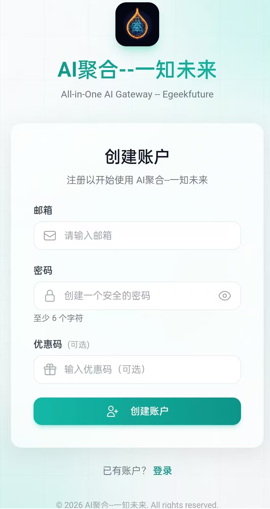

**02** 兑换或**充值**（有兑换码填码兑换，或者按需充值或订阅套餐）

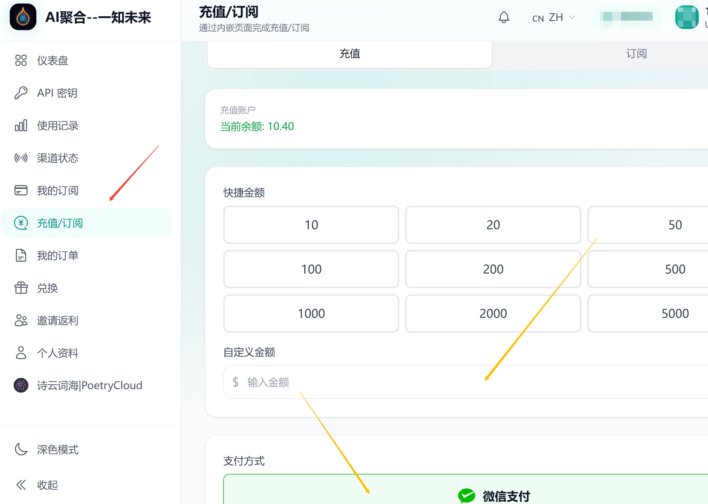

根据控制台展示的模型价格充值。余额按实际调用量扣除，余额可跨月使用。

**03**创建密钥** --**进入 API Key 页面创建密钥，并设置名称、选好分组，确定创建。

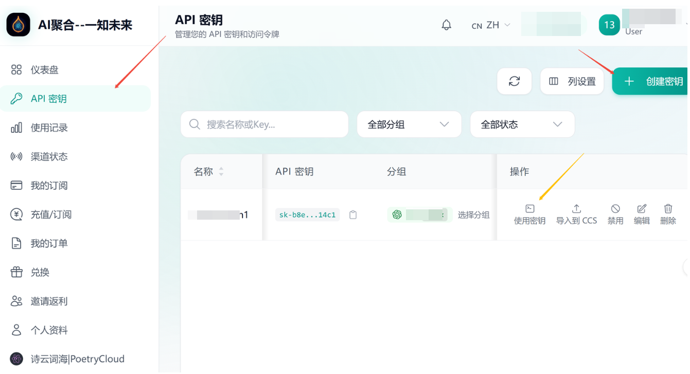

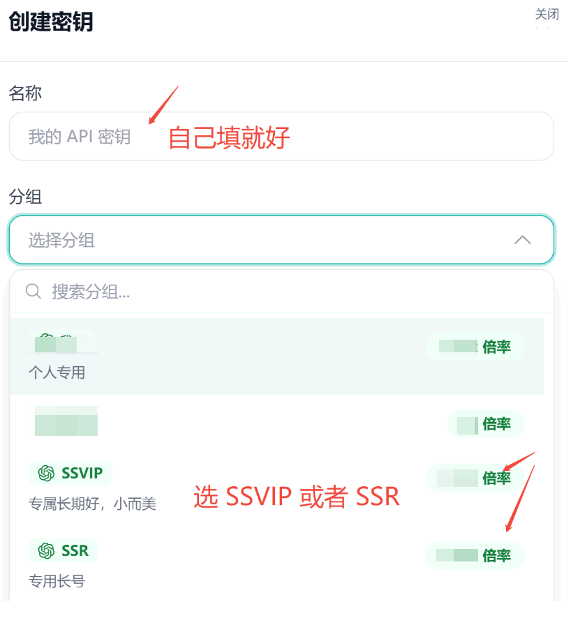

**04**开始调用** --**使用密钥，复制 Base URL 和 API Key，填入 OpenCode智能体工具。

点击「使用密钥」--》选「OpenCode」--》复制配置代码。

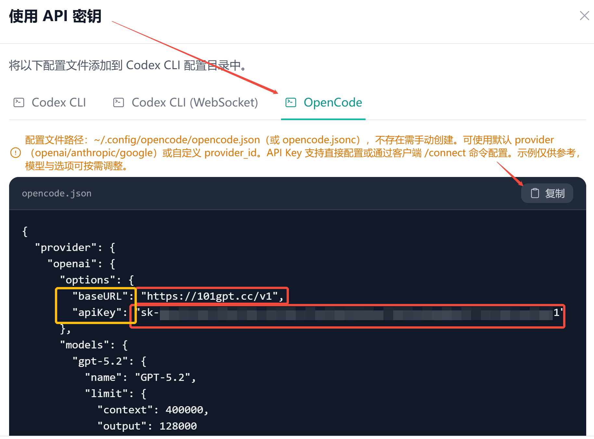

这个代码中最重要的信息，就是你的 apiKey，记得不要泄露给其他人哦。而 baseURL 对应就是大模型供应商 链接 **https://101gpt.cc/v1**

你在这里也可以直接复制保存你的  **apiKey**

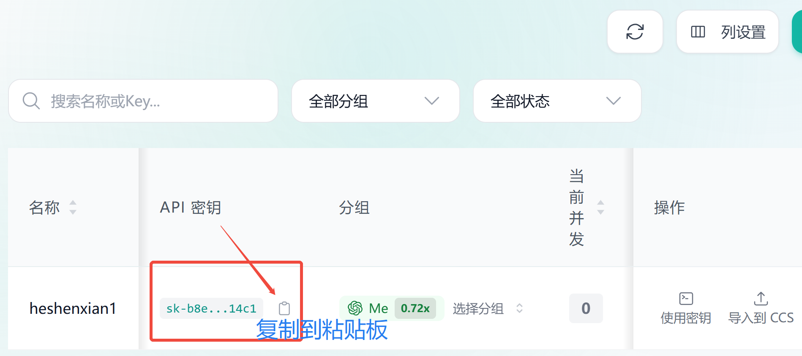

电脑端下载好智能体软件 OpenCode ，我这里在云盘为你提供好可下载的软件。

- 如果是** 微软的Window系统**，下载这个版本的 opencode
通过网盘分享的文件：opencode-desktop-windows-x64-1-14-24-0.exe

链接: https://pan.baidu.com/s/1BC3hw4f-lWBPYvbBPfR4oA?pwd=8q87 提取码: 8q87

- 如果是** Intel 芯片的苹果Mac**电脑，下载这个版本的 opencode
通过网盘分享的文件：OpenCode-macOS (Intel).dmg

链接: https://pan.baidu.com/s/1AXvVRWlvDa8EeRsIdv3kPg?pwd=p89a 提取码: p89a

如果是 **苹果自家芯片的苹果Mac**电脑，下载这个版本的 opencode

通过网盘分享的文件：OpenCode-macOS (Apple Silicon).dmg

链接: https://pan.baidu.com/s/1--dJanQKL54Ri2o4tbvn1Q?pwd=53nu 提取码: 53nu

下载好之后，安装 OpenCode ，安装完成后在桌面点击启动 OpenCode

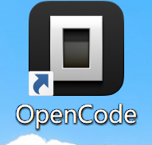

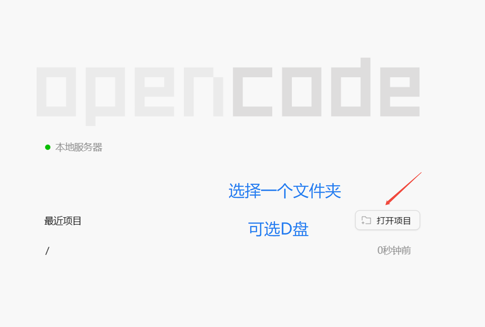

刚开始「打开项目」就是选一个文件夹📂或者存储盘就好，智能体对具体的范围发挥智能，不会额外做功。小何在 Windows 电脑通常先选了 **D盘，**而苹果Mac 通常选择 Download 文件夹📂。**

然后把刚才在「使用密钥」中复制的代码直接 **Ctrl+V** 粘贴给 OpenCode 对话框，让它去配置好供应商API，然后关闭 OpenCode，重新打开它。

你在「选择模型」中，就能看到 OpenAI 家的**一流AI大模型**了，比如 gpt-5.6 系列。

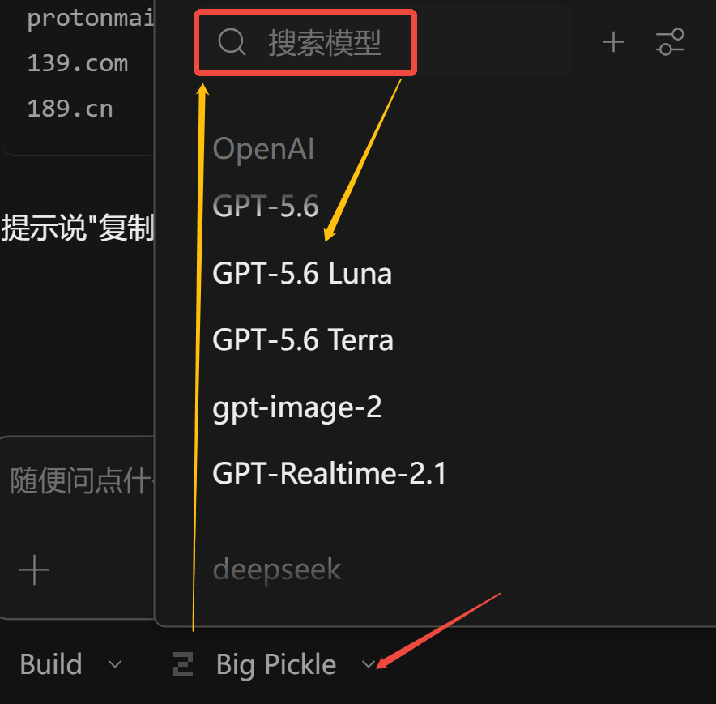

用上 OpenCode，开始用上你的**AI数字员工**，让它给你干活吧！

**【补充】——** 另一种手动添加大模型供应商和APIKey 的方法。

调用你的API，你手上有两个关键信息：

一个是模型供应商链接 baseURL ，在我们的这个AI中台这里是：

https://101gpt.cc/v1

另一个是你自己要保管好的 API密钥 apiKey  "sk-**" 开头的字段。

手动添加供应商如下图指引：左下角⚙️设置那里点开，再选择「供应商」--》自定义供应商。

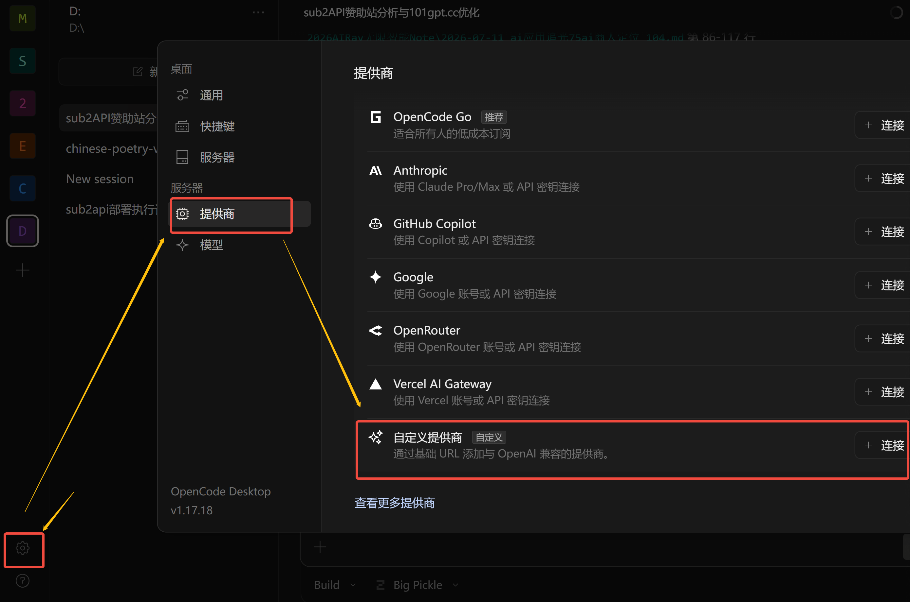

供应商信息如供应商ID、现实名称可以你自己填，比如咱们站 你可以填 101gpt

而基础URL，API密钥上面都提到了。模型部分可填可不填。由于 OpenCode是智能体，建议你遇事不决，就问它解决是聪明办法。

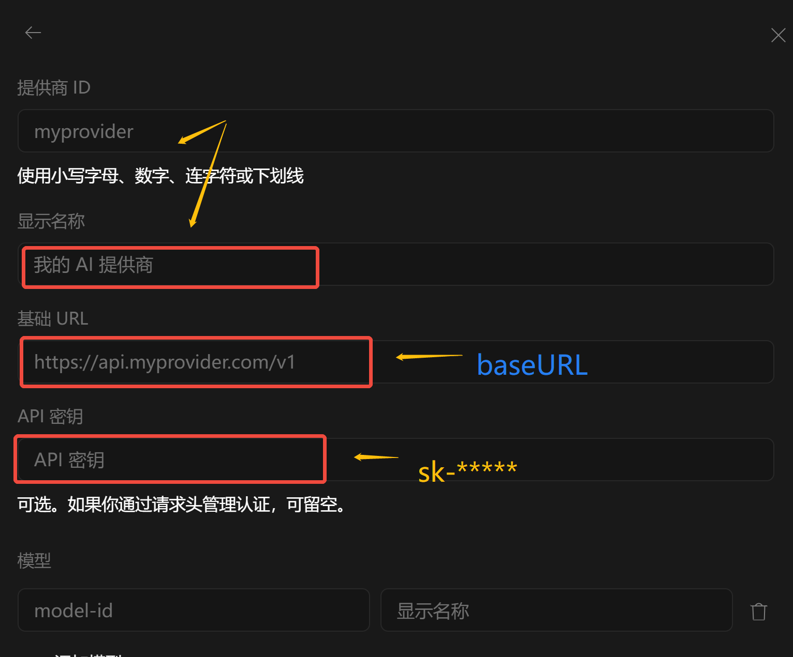

【补充】——思维篇

上面 AI中台注册API应用流程步骤应该讲得挺细了。有两点思维转变，会带给你不一样的旅程。

第一个是——** AI first**。重要事情说三遍：** AI first， AI first， AI first！**

遇事不决，先问AI。AI时代，最便捷的解惑决疑的路径就是第一时间问AI。我也是在不断经历中改变自己的思维习惯。从下意识问其他人，变成第一时间想到问AI，要不找AI直接搞定问题，要不找AI补充背景信息，在和他人有更深入交流。毕竟你手下已经有了一流大模型和其他够用的辅助大模型。

**AI first，电脑问题找AI，修理Bug做批处理找AI，写文案咨询AI，做策划问AI ……**

第二个是—— **高低搭配，干活不累**。AI也可以有团队，AI也能相互打配合。让AI组队更好为你打工。

简单任务问题找普通模型，复杂高智难题找一流模型。

一流模型思考做方案，次流模型细化做执行，这样搭配**性价比高**。

opencode 的其中一个好处，有不少免费模型额度就能解决处理很多日常任务。所有事都找最聪明的 gpt 很费token ，它的高智能用到尖兵连更划算。

**一流模型**相当于 教授专家和博士生，**次等模型**就是分级的研究生本科生，还有更次等的相当于高中生初中生。

你可以搭配着用找感觉哈。当然欢迎土豪，就都用最精锐的，也是非常非常爽的😄。

如有售后疑问 可咨询客服

WeChat：**hexiaoman42**
