

# 🤖 AI中台注册API应用保姆级指南（一知未来）

**从注册到调用，几分钟内完成** · 注册 → 充值 → 创建密钥 → 调用 API

[📖 网页版指南](readme.html) · [📊 A股量价TOP20看板](index-top20.html) · [🌐 AI中台](https://101gpt.cc)

---

## 🚀 快速四步走

### 01 · 注册账号

使用常用邮箱注册并登录控制台。

👉 **注册入口**：<https://101gpt.cc/register?aff=3KDMPTVKGK29>

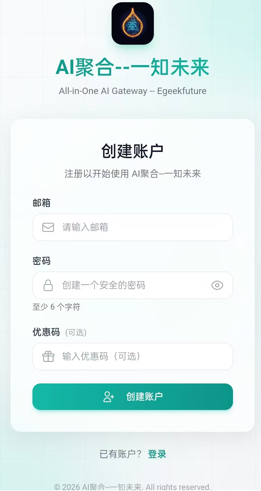

---

### 02 · 兑换或充值

有兑换码填码兑换，或者按需充值或订阅套餐。

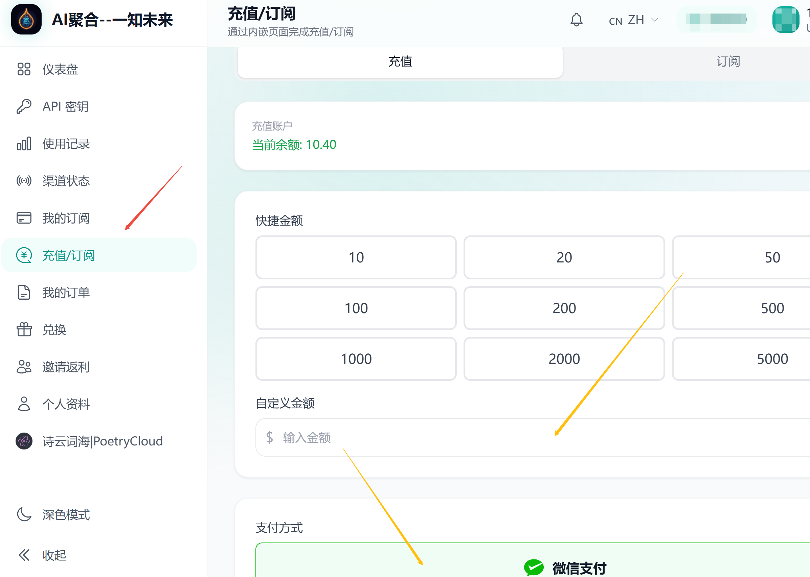

> 💡 **提示**：根据控制台展示的模型价格充值。余额按实际调用量扣除，余额可跨月使用。

---

### 03 · 创建密钥

进入 **API Key** 页面创建密钥，并设置名称、选好分组，确定创建。

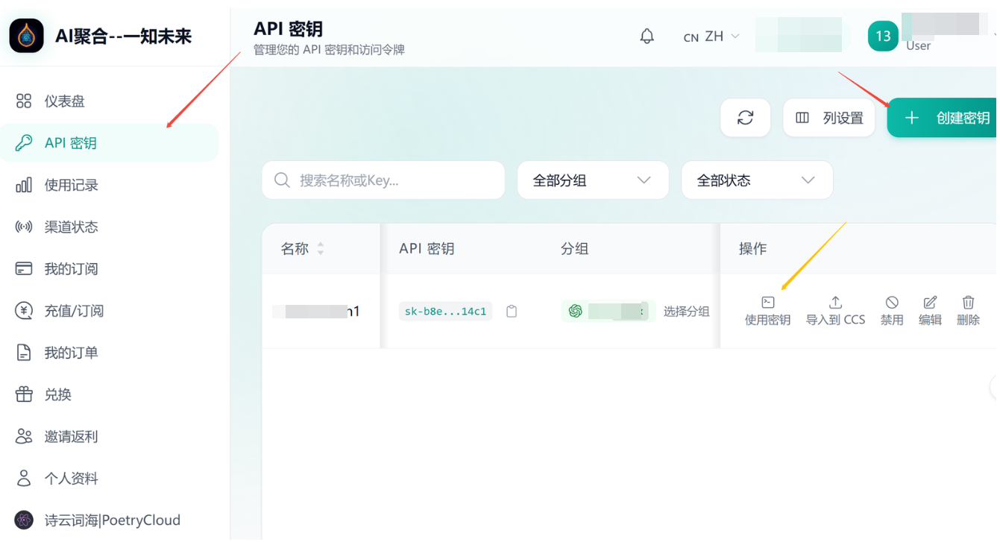

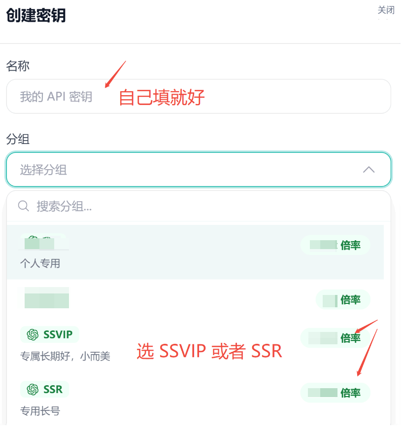

---

### 04 · 开始调用

使用密钥，复制 **Base URL** 和 **API Key**，填入 OpenCode 智能体工具。

点击「使用密钥」→ 选「OpenCode」→ 复制配置代码。

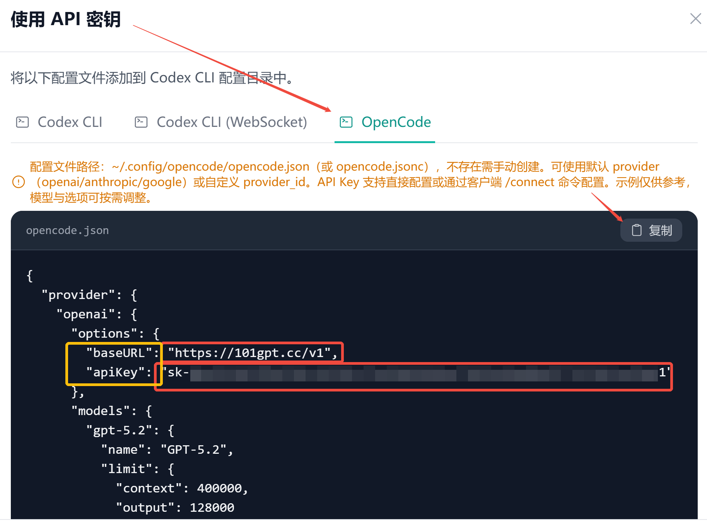

> ⚠️ **重要**：这个代码中最重要的信息，就是你的 **apiKey**，记得不要泄露给其他人哦。而 **baseURL** 对应就是大模型供应商链接：`https://101gpt.cc/v1`

你在这里也可以直接复制保存你的 **apiKey**。

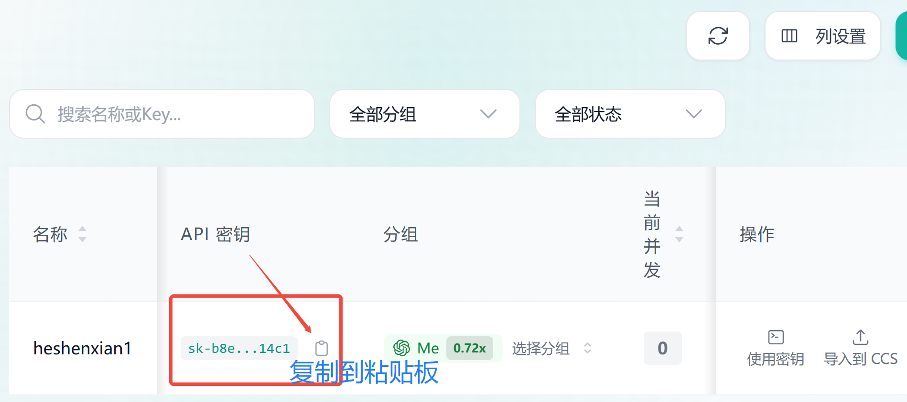

---

## 📥 下载并安装 OpenCode

电脑端下载好智能体软件 OpenCode，云盘已为你备好各平台安装包：

| 平台 | 安装包 | 网盘链接 | 提取码 |
|------|--------|----------|:---:|
| 🪟 Windows | `opencode-desktop-windows-x64-1-14-24-0.exe` | <https://pan.baidu.com/s/1BC3hw4f-lWBPYvbBPfR4oA?pwd=8q87> | `8q87` |
| 🍎 Mac（Intel） | `OpenCode-macOS (Intel).dmg` | <https://pan.baidu.com/s/1AXvVRWlvDa8EeRsIdv3kPg?pwd=p89a> | `p89a` |
| 🍏 Mac（Apple 芯片） | `OpenCode-macOS (Apple Silicon).dmg` | <https://pan.baidu.com/s/1--dJanQKL54Ri2o4tbvn1Q?pwd=53nu> | `53nu` |

---

## ⚙️ 安装与配置

下载好之后安装 OpenCode，安装完成后在桌面点击启动。

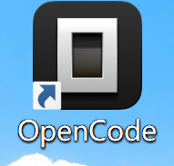

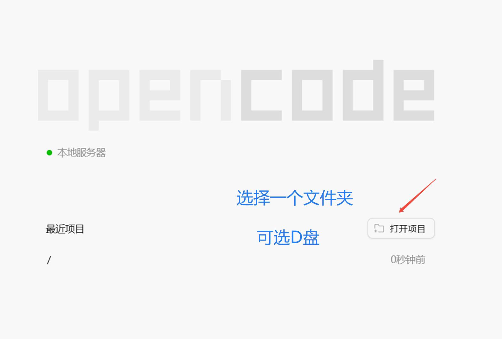

刚开始「打开项目」就是选一个文件夹 📂 或者存储盘就好，智能体对具体的范围发挥智能，不会额外做功。小何在 Windows 电脑通常先选了 **D盘**，而苹果 Mac 通常选择 **Download 文件夹** 📂。

> 🔧 **操作**：把刚才在「使用密钥」中复制的代码直接 **Ctrl+V** 粘贴给 OpenCode 对话框，让它去配置好供应商 API，然后关闭 OpenCode，重新打开它。

你在「选择模型」中，就能看到 OpenAI 家的**一流 AI 大模型**了，比如 gpt-5.6 系列。

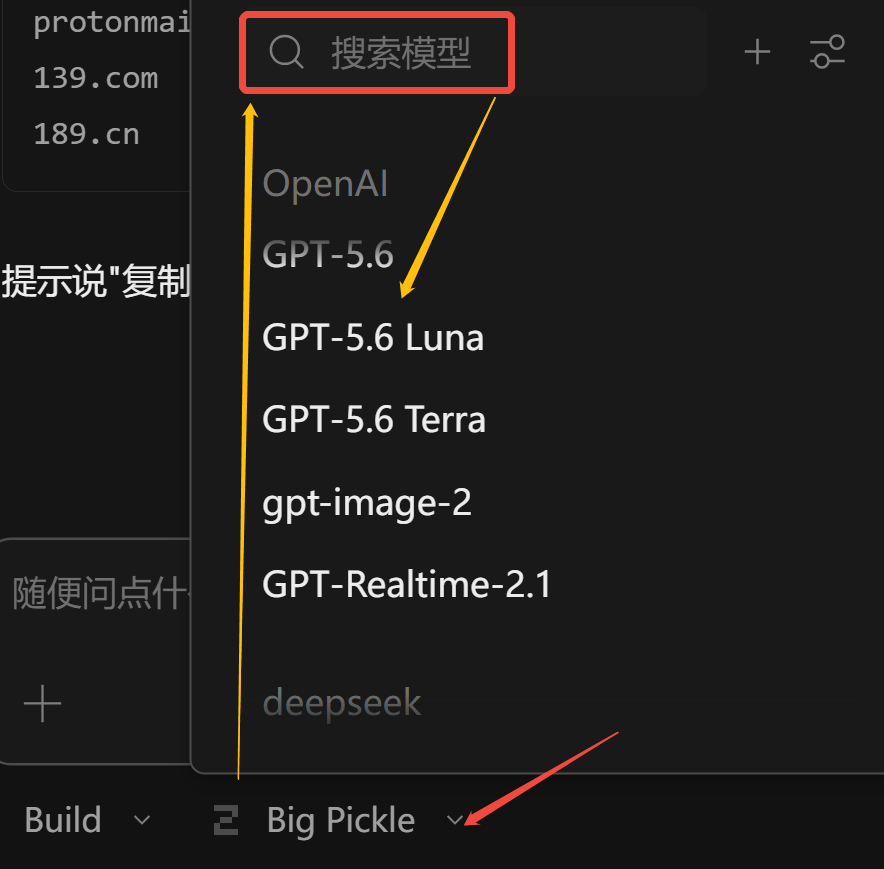

用上 OpenCode，开始用上你的 **AI 数字员工**，让它给你干活吧！🎉

---

## 📌 补充一：手动添加供应商与 API Key

调用你的 API，你手上有两个关键信息：

| 信息 | 值 |
|------|-----|
| **baseURL**（模型供应商链接） | `https://101gpt.cc/v1` |
| **apiKey**（API密钥，需自行保管） | `sk-` 开头的字段 |

手动添加供应商：左下角 ⚙️ **设置** → 选择「供应商」→ **自定义供应商**。

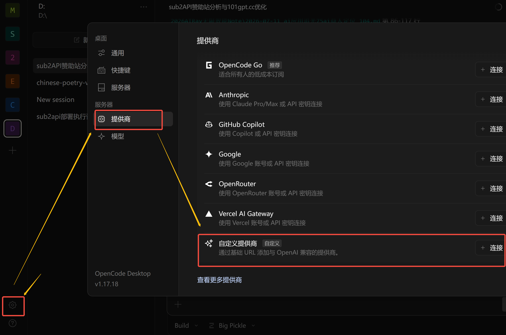

> 💡 **提示**：供应商信息如供应商 ID、现实名称可以你自己填，比如咱们站你可以填 **101gpt**。而基础 URL、API 密钥上面都提到了。模型部分可填可不填。由于 OpenCode 是智能体，建议你遇事不决，就问它解决是聪明办法。

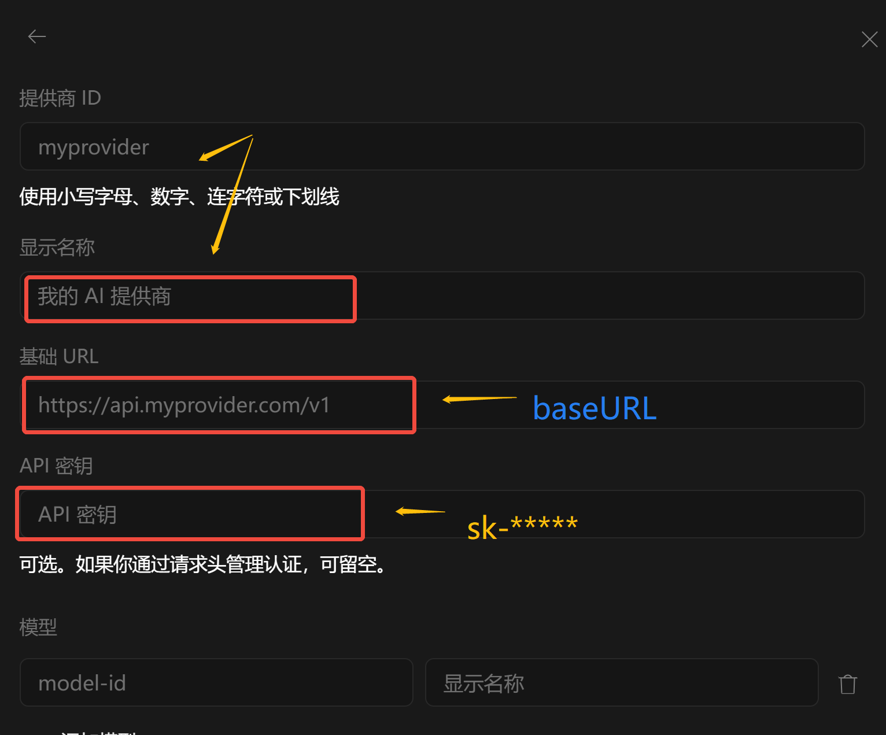

---

## 🧠 补充二：思维篇

上面流程步骤应该讲得挺细了。有两点思维转变，会带给你不一样的旅程。

### 第一个 —— AI first

> **AI first，AI first，AI first！** 遇事不决，先问 AI。AI 时代，最便捷的解惑决疑的路径就是第一时间问 AI。AI first，电脑问题找 AI，修理 Bug 做批处理找 AI，写文案咨询 AI，做策划问 AI……

### 第二个 —— 高低搭配，干活不累

AI 也可以有团队，AI 也能相互打配合。让 AI 组队更好为你打工。简单任务问题找普通模型，复杂高智难题找一流模型。

> 💡 **性价比策略**：一流模型思考做方案，次流模型细化做执行，这样搭配**性价比高**。opencode 的其中一个好处，有不少免费模型额度就能解决处理很多日常任务。所有事都找最聪明的 gpt 很费 token，它的高智能用到尖兵连更划算。

| 模型档次 | 类比 | 用途 |
|----------|------|------|
| 🎓 一流模型 | 教授专家、博士生 | 思考做方案 |
| 🎓 次等模型 | 研究生、本科生 | 细化做执行 |
| 📘 更次等 | 高中生、初中生 | 日常简单任务 |

你可以搭配着用找感觉哈。当然欢迎土豪，就都用最精锐的，也是非常非常爽的 😄。

  
   <em>👆 扫码添加客服微信</em>

---

## 📞 售后咨询

如有售后疑问，可咨询客服：

**WeChat：`hexiaoman42`**

---

*由 README 生成网页版见 [readme.html](readme.html) · 更多 AI 实践案例见仓库其他页面*

